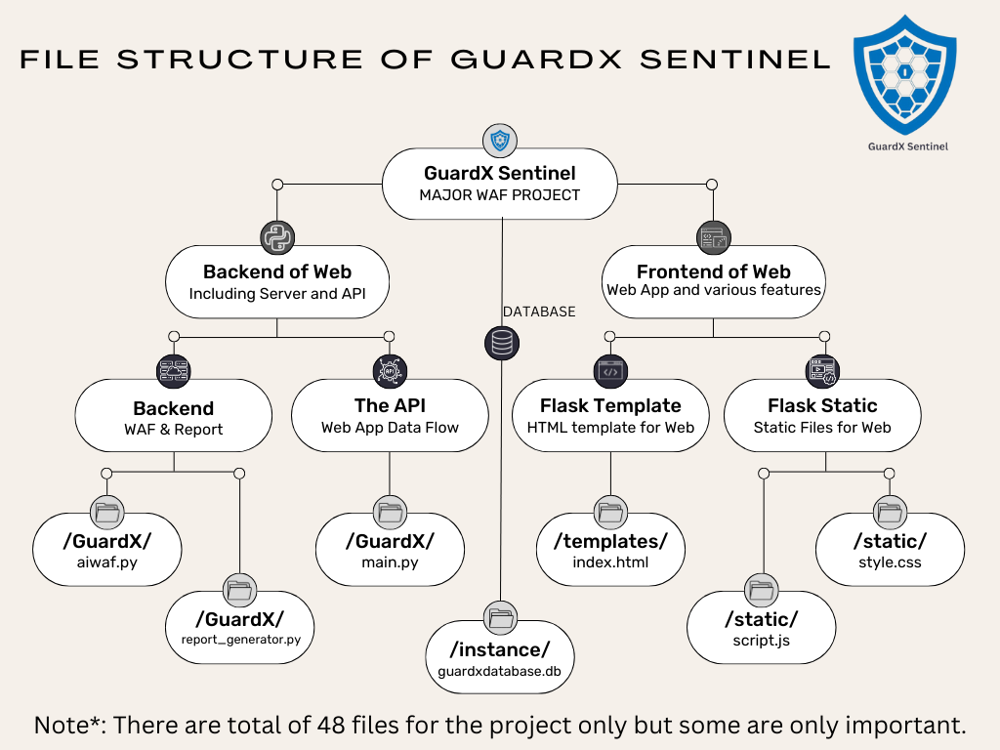

# GuardX-Thesis

>GUARDX SENTINEL || Product of Ineffable Inc.
           
GuardX Sentinel is the product developed by the Ineffable Inc. which is working in the development of various products which will effectively help in the solution of the various security problems which are introduced each time.
With the help of this tool, you can have the proper 

## Important Files of GuardX Sentinel

Just go the project directory named as GuardX and on it in order to run the project perform the following.

Run the command as below for downloading the requirements needed for the project to run.
## For Widows
  -      pip install -r requirements.txt
## For MAC and Linux
  -      pip3 install -r requirements.txt

After this just run the code for training the WAF with data-sets provided.
## For Windows
  -      python aiwaf.py
## For MAC and Linux
  -      python3 aiwaf.py

After that run the command which will run the server and also the AI for testing.
## For Windows
   -     python main.py
## For MAC and Linux
   -     python3 main.py

It will run the service on `localhost:5000` which will provide a webpage through which you can run the program.
On the browser you can run the web application in four different ways after running the `main.py` file in the system.

- localhost:5000
- localhost:5000/home
- 127.0.0.1:5000
- 127.0.0.1:5000/home
